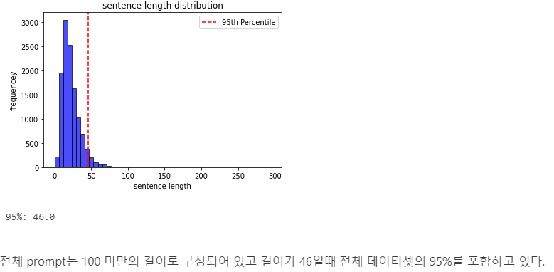
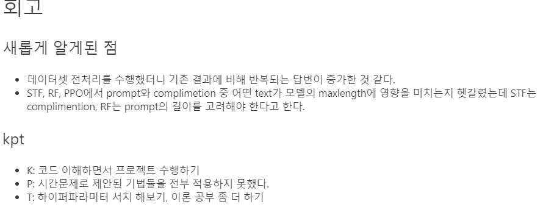

# AIFFEL Campus Online Code Peer Review Templete
- 코더 : 홍서이
- 리뷰어 : 이태훈


# PRT(Peer Review Template)
- [O] **1. 주어진 문제를 해결하는 완성된 코드가 제출되었나요?**
- 문제에서 요구하는 최종 결과물이 첨부되었는지 확인
- 문제를 해결하는 완성된 코드란 프로젝트 루브릭 3개 중 2개, 퀘스트 문제 요구조건 등을 지칭
- 해당 조건을 만족하는 코드를 캡쳐해 근거로 첨부

> EDA를 통해 텍스트의 대부분의 길이가 46이하임을 알아냈으며, 이를 통해 Max_len을 조절하여 성능을 향상시킴!



---

- [O] **2. 전체 코드에서 가장 핵심적이거나 가장 복잡하고 이해하기 어려운 부분에 작성된 주석 또는 doc string을 보고 해당 코드가 잘 이해되었나요?**
- 해당 코드 블럭에 doc string/annotation이 달려 있는지 확인
- 해당 코드가 무슨 기능을 하는지, 왜 그렇게 짜여진건지, 작동 메커니즘이 뭔지 기술.
- 주석을 보고 코드 이해가 잘 되었는지 확인
- 잘 작성되었다고 생각되는 부분을 캡쳐해 근거로 첨부합니다.

```python
# 훈련을 위한 마지막 단계로 Training arguments를 사용해 trainer 클래스 정의
training_args = TrainingArguments(
    output_dir="aiffel/KoChatGPT/test",
    overwrite_output_dir=True,
    num_train_epochs=1,
    per_device_train_batch_size=8,
    per_device_eval_batch_size=8,
    warmup_steps=5,
    prediction_loss_only=True,
    fp16 = True
    )
trainer = Trainer(
    model=model,
    args=training_args,
    data_collator=data_collator,
    train_dataset=train_dataset
)
```

---

- [O] **3. 에러가 난 부분을 디버깅하여 문제를 “해결한 기록을 남겼거나”,”새로운 시도 또는 추가 실험을 수행”해봤나요?**
- 문제 원인 및 해결 과정을 잘 기록하였는지 확인
- 문제에서 요구하는 조건에 더해 추가적으로 수행한 나만의 시도,
실험이 기록되어 있는지 확인
- 잘 작성되었다고 생각되는 부분을 캡쳐해 근거로 첨부합니다.

> BLUE를 이용한 정량적 평가 매트릭을 구현했습니다. 

```python
from nltk.translate.bleu_score import sentence_bleu, SmoothingFunction

# 모델이 생성한 텍스트
model_output = "미세먼지 문제가 심각하다면, 매일 가습기나 청소기를 사용하거나, 실내공기정화 시스템을 사용하는 등 다양한 방법으로 문제를 해결할 수 있습니다. 미세먼지에 대한 대처 방법도 알아보세요. 또한 미세먼지 제거를 위해서는 외출 시 항상 깨끗한 실내 환경을 유지하는 것도 좋은 방법입니다. 미세먼지 제거를 위해 공기청정기나 공기청정기를 사용하는 것은 미세먼지의 수를 줄여 주는 방법 중 하나입니다. 신으로아스터교에서는 공기청정기와 공기청정기 같은 수면과 보호용품을 사용하여 미세먼지를 효과적으로 제거할 수 있습니다.神神敎에서는 공기정화 및 공기청정기를 사용하여 미세먼지를 줄이는 방법을 제안하고 있습니다.神敎는 공기정화 시스템을 사용하여 미세먼지의 양을 줄이는 방법 중 하나입니다.神敎는 공기정화 기능이 있는 공기정화장치도 도입하고 있습니다.臣敎는 미세먼지의 수를 줄이는 방법 중 하나입니다.神敎에서는 공기를 깨끗하게 하고 공기질을 줄이기 위해 공기청정기와 공기청정기를 사용기를 이용하여 미세먼지를 효과적으로 제거할 수 있습니다.申子神敎는 공기정화장치 또한 사용하고 있어, 각 상황에 따라 수치와 방법을"
# 참조 텍스트 (리스트 형태로 여러 개의 참조 텍스트를 제공할 수도 있습니다)
reference_text = ["현재 서울의 미세먼지 농도는 206 마이크로그램으로, 중부지방은 ‘매우 나쁨’ 단계가 계속되고 있습니다. 남부지방은 150 마이크로그램 안팎으로 어제보다 농도가 낮지만 여전히 미세먼지 경보나 주의보가 내려진 곳이 많습니다. 전국의 미세먼지 농도는 ‘매우 나쁨’ 단계가 예상됩니다",
                  "오늘은 미세먼지 농도가 매우 나쁘므로 실외 활동을 자제하는 게 좋습니다.", 
                  "오늘 미세먼지는 매우 좋습니다. 가족들과 함께 바깥 활동을 즐기세요!",
                 "죄송합니다. 잘 모르겠습니다."]

# BLEU 스코어를 계산하는 함수
def calculate_bleu_score(model_output, reference_text):
    # Smoothing 함수를 사용하여 0으로 나누는 것을 방지합니다.
    smoothing = SmoothingFunction().method1
    # BLEU 스코어 계산
    bleu_score = sentence_bleu(reference_text, model_output, smoothing_function=smoothing)
    return bleu_score

# BLEU 스코어 계산
score4 = calculate_bleu_score(model_output.split(), [ref.split() for ref in reference_text])

```

---

- [O] **4. 회고를 잘 작성했나요?**
- 주어진 문제를 해결하는 완성된 코드 내지 프로젝트 결과물에 대해 배운점과 아쉬운점, 느낀점 등이 기록되어 있는지 확인
- 전체 코드 실행 플로우를 그래프로 그려서 이해를 돕고 있는지 확인
- 잘 작성되었다고 생각되는 부분을 캡쳐해 근거로 첨부합니다.

> 네! 

  

---

- [O] **5. 코드가 간결하고 효율적인가요?**
- 파이썬 스타일 가이드 (PEP8) 를 준수하였는지 확인
- 하드코딩을 하지않고 함수화, 모듈화가 가능한 부분은 함수를 만들거나 클래스로 짰는지
- 코드 중복을 최소화하고 범용적으로 사용할 수 있도록 함수화했는지
- 잘 작성되었다고 생각되는 부분을 캡쳐해 근거로 첨부합니다.

> 네!

---

# 참고 링크 및 코드 개선
```
# 코드 리뷰 시 참고한 링크가 있다면 링크와 간략한 설명을 첨부합니다.
# 코드 리뷰를 통해 개선한 코드가 있다면 코드와 간략한 설명을 첨부합니다.